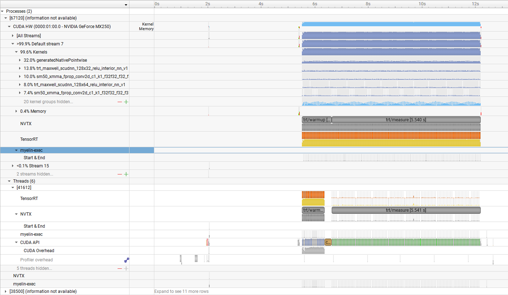
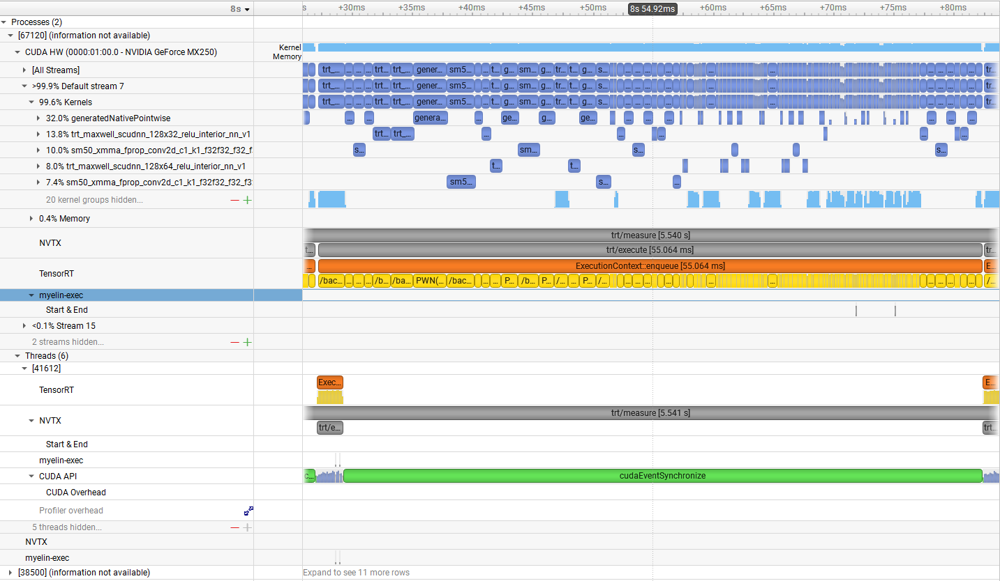

# Phase 2 TensorRT 基线报告

> **报告目标**：总结 EfficientViT-Seg-B0 从 PyTorch 到 ONNX / TensorRT 的部署结果，量化 TensorRT baseline 相对 Phase 1 PyTorch baseline 的收益，并复核 Phase 1 的 Phase 3 Plugin 候选在 TensorRT 优化后是否仍然成立。
>
> **核心口径**：端到端 latency 使用 CUDA Events；TensorRT runtime 热点使用 Nsight SQLite `correlationId` 归因；EngineInspector 只作为结构证据，不作为真实 GPU 耗时证据。

---

## 1. 结论摘要

Phase 2 已完成固定 shape `1x3x1024x2048` 的 `PyTorch -> ONNX -> TensorRT` 基础部署链路。

主要结论：

1. **ONNX baseline 成立**：ONNX 导出通过 `onnx.checker`，ONNXRuntime CPU 输出与 PyTorch CUDA 输出在 `atol=1e-4 / rtol=1e-4` 下通过 allclose。
2. **TensorRT FP32 baseline 成立**：TensorRT 8.6.1 可成功构建并运行 FP32 engine，输出 shape 为 `[1, 19, 128, 256]`。
3. **TensorRT FP32 有明确速度收益**：PyTorch Phase 1 Plan A p50 为 `85.70 ms`，TensorRT FP32 p50 为 `54.44 ms`，p50 speedup 约 `1.57x`。
4. **FP16 不作为本机主 baseline**：FP16 engine 可构建且语义输出一致，但 MX250 上 FP16 p50 为 `59.39 ms`，慢于 FP32。
5. **TensorRT 自动优化有效，但没有消除所有热点**：ONNX `393` nodes 被 TensorRT 降到 `155` engine layers，出现 PWN pointwise fusion 与显式 `+` fusion；Nsight runtime 仍显示 `stage0 > stage2 > stage3 > stage1 > head > stem` 的残余热点排序。尤其是 `stage2/context` LiteMLA 没有被自动合成一个单独 fused operator，仍残留 Conv / ReLU / Pad / MatMul / Div / Add 等多类相关 engine layers。
6. **Phase 3 Plugin 候选需要保留 Phase 1 口径**：Phase 1 Plan D 的 MVP 仍是 `relu_linear_att-only` / `aggregation-only`，主性能边界仍是 `aggregation + cat + relu_linear_att`。Phase 2 的 `attention_core` / `aggregation_plus_attention_core` 只是 TensorRT 侧 residual-runtime proxy，不能反向改写 Phase 1 候选定义。

---

## 2. 阶段范围与测量协议

### 2.1 阶段范围

Phase 2 做：

- 固定 shape ONNX 导出。
- ONNXRuntime 输出对齐。
- TensorRT FP32 / FP16 engine 构建。
- TensorRT CUDA Events latency benchmark。
- TensorRT Nsight Systems runtime attribution。
- TensorRT C++ Runtime API smoke demo。

Phase 2 不做：

- 不实现 TensorRT Plugin。
- 不替换 LiteMLA 内部 CUDA kernel。
- 不做完整 Cityscapes mIoU。
- 不追求动态 shape。

### 2.2 计时口径

| 项目 | 口径 |
|---|---|
| PyTorch Phase 1 latency | CUDA Events，`model(x)` 推理本体 |
| TensorRT latency | CUDA Events，只测 `context.execute_async_v2(...)` |
| warmup / measure | `20 / 100` |
| 输入 | 固定图片，固定 `1024x2048` |
| 数据搬运 | 不计入 latency；input/output GPU buffer 在计时前准备 |
| Nsight 归因 | TensorRT/NVTX layer range -> CUDA runtime launch -> CUDA kernel `correlationId` |
| 禁止口径 | 不用 NVTX range end-start 作为 GPU component time |

---

## 3. 证据索引

| 证据 | 文件 |
|---|---|
| Phase 1 PyTorch baseline | [`../phase1/results/metrics/baseline_b0_cityscapes_1024x2048_levelA_latency_formal_v1.json`](../phase1/results/metrics/baseline_b0_cityscapes_1024x2048_levelA_latency_formal_v1.json) |
| Phase 1 bottleneck report | [`../phase1/bottleneck_analysis_report.md`](../phase1/bottleneck_analysis_report.md) |
| ONNX export metadata | [`results/metrics/onnx_export_b0_cityscapes_1024x2048.json`](results/metrics/onnx_export_b0_cityscapes_1024x2048.json) |
| TensorRT FP32 build | [`results/metrics/trt_build_b0_cityscapes_1024x2048_fp32.json`](results/metrics/trt_build_b0_cityscapes_1024x2048_fp32.json) |
| TensorRT FP16 build | [`results/metrics/trt_build_b0_cityscapes_1024x2048_fp16.json`](results/metrics/trt_build_b0_cityscapes_1024x2048_fp16.json) |
| TensorRT FP32 benchmark | [`results/metrics/trt_benchmark_b0_cityscapes_1024x2048_fp32.json`](results/metrics/trt_benchmark_b0_cityscapes_1024x2048_fp32.json) |
| TensorRT FP16 benchmark | [`results/metrics/trt_benchmark_b0_cityscapes_1024x2048_fp16.json`](results/metrics/trt_benchmark_b0_cityscapes_1024x2048_fp16.json) |
| TensorRT Nsight attribution | [`results/metrics/trt_nsys_attribution_summary.md`](results/metrics/trt_nsys_attribution_summary.md) |
| TensorRT Nsight overview figure | [`results/figures/trt_timeline_overview.png`](results/figures/trt_timeline_overview.png) |
| TensorRT single execute figure | [`results/figures/trt_execute_single_iter.png`](results/figures/trt_execute_single_iter.png) |
| TensorRT EngineInspector | [`results/metrics/trt_engine_inspection_summary.md`](results/metrics/trt_engine_inspection_summary.md) |
| C++ runtime demo | [`cpp_demo/README.md`](cpp_demo/README.md) |

---

## 4. ONNX 导出与运行时对齐

ONNX 导出结果：

| 项目 | 结果 |
|---|---|
| ONNX opset | `17` |
| ONNX checker | passed |
| ONNX nodes | `393` |
| Input | `input`, `[1, 3, 1024, 2048]` |
| Output | `segout`, `[1, 19, 128, 256]` |
| ONNXRuntime provider | `CPUExecutionProvider` |

PyTorch CUDA vs ONNXRuntime CPU 对齐结果：

| 指标 | 结果 |
|---|---:|
| `max_abs_diff` | `3.44e-4` |
| `mean_abs_diff` | `1.81e-5` |
| `cosine_similarity` | `0.99999999999` |
| `allclose(atol=1e-4, rtol=1e-4)` | `true` |

结论：ONNX 固定 shape 导出可用，ONNXRuntime 与 PyTorch 输出达到 Phase 2 转换一致性要求。这里不要求 bitwise identical，因为对比跨越 PyTorch CUDA 与 ONNXRuntime CPU 两套执行后端。

---

## 5. TensorRT Engine 构建结果

当前可用 TensorRT 环境：

| 项目 | 结果 |
|---|---|
| GPU | NVIDIA GeForce MX250 (`sm_61`) |
| TensorRT | `8.6.1` |
| TensorRT root | `E:\NVIDIA\TensorRT-8.6.1.6` |
| Workspace | `1024 MiB` |
| Network definition | explicit batch |

Engine 构建结果：

| Engine | Parser errors | Engine size | TensorRT layers | 结论 |
|---|---:|---:|---:|---|
| FP32 | `0` | `3,674,476 bytes` | `155` | 主 baseline |
| FP16 | `0` | `3,550,252 bytes` | `157` | 风险实验，不作为本机主 baseline |

构建日志中存在两个需记录但不阻塞的问题：

- ONNX 中存在 INT64 权重，TensorRT 会尝试 cast 到 INT32，并可能 clamp 超范围值。
- MX250 不支持 TF32，TensorRT 默认 TF32 flag 会被禁用。

后续 benchmark 与输出对齐表明这些构建期转换没有破坏当前固定输入下的语义输出。

---

## 6. 延迟与输出对齐

### 6.1 延迟

| 路径 | mean ms | p50 ms | p95 ms | p99 ms | 相对 PyTorch p50 |
|---|---:|---:|---:|---:|---:|
| PyTorch FP32 Phase 1 Plan A | `85.76` | `85.70` | `86.51` | `87.63` | `1.00x` |
| TensorRT FP32 | `54.53` | `54.44` | `55.43` | `55.68` | `1.57x` |
| TensorRT FP16 | `60.65` | `59.39` | `65.34` | `66.85` | `1.44x` |

解释：

- TensorRT FP32 是当前本机主 baseline。
- FP16 在 MX250 上没有速度收益，p50 比 FP32 慢约 `9.1%`。这符合 Pascal MX250 没有 Tensor Core、FP16 不一定加速的预期。
- FP16 可作为“可构建且语义一致”的风险实验记录，但不应包装成性能优化主线。

### 6.2 输出对齐

TensorRT FP32 vs PyTorch CUDA：

| 指标 | 结果 |
|---|---:|
| `max_abs_diff` | `2.69e-4` |
| `mean_abs_diff` | `2.54e-5` |
| `cosine_similarity` | `0.99999999998` |
| strict allclose `1e-4` | `false` |
| relaxed allclose `1e-3` | `true` |
| argmax pixel agreement | `100%` |
| argmax mismatch pixels | `0 / 32768` |

TensorRT FP16 当前固定输入下得到同样的 relaxed alignment 与 `100%` argmax pixel agreement。

结论：TensorRT 输出不能表述为“逐元素严格一致”，但可以表述为“logits 数值接近，语义输出一致”。Phase 2 不做完整 mIoU；后续已在 Phase 3 P1a stage2+stage3 Plugin 集成验证中完成 Cityscapes val mIoU gate。

---

## 7. TensorRT 自动优化了什么

EngineInspector 结构证据：

| 项目 | 结果 |
|---|---:|
| ONNX nodes | `393` |
| TensorRT engine layers | `155` |
| Overall layer-count reduction | `60.56%` |
| TensorRT `pointwise_fusion` layers | `37` |
| TensorRT explicit `+` fusion layers | `16` |
| TensorRT `conv` layers | `56` |
| TensorRT `matmul` layers | `10` |

能说明的事情：

- TensorRT 明显进行了 graph simplification / pointwise fusion / activation fusion / explicit fusion。
- `PWN(...)` layer 表明 HardSwish、Relu、Add、Div 等 pointwise 路径被合并。
- layer name 中的 ` + ` 表明 TensorRT 将多个 ONNX-named operations 合并成单个 engine layer。
- 但 TensorRT 没有把 `stage2/context` LiteMLA 自动合成一个单独 fused operator。EngineInspector 中仍能看到 `qkv/Conv`、`aggreg.0/Conv`、`Relu`、`Pad`、`MatMul`、`Add/Div`、`proj/Conv + Add` 等多个 LiteMLA 相关 engine layers。
- SegHead bicubic `Resize` 在当前固定 shape / TensorRT 8.6.1 下可 parse、可 build、可 runtime。

不能说明的事情：

- EngineInspector 不提供真实 GPU kernel 耗时。
- 当前 EngineInspector detail 为 `layer_names_only`，不含详细 tactic metadata。
- “TensorRT 自动优化了某些结构”不等于“这些结构不再是 runtime hotspot”；真实耗时仍需 Nsight attribution。
- “LiteMLA 未被自动融合成单算子”是结构证据；“这些残留是否值得手写 Plugin”仍需结合第 8/9 节的 runtime attribution 判断。

---

## 8. TensorRT 运行时归因

图 1 展示 TensorRT benchmark 的 Nsight Systems 全局时间线。`trt/warmup` 与 `trt/measure` 两个 NVTX range 清晰可见，CUDA HW 轨道在 measure 区间内持续执行 kernels。该图用于证明 Nsight trace 覆盖了 TensorRT engine runtime；定量结论仍以后续 SQLite attribution 表为准。

TensorRT Nsight attribution 结果：

| 项目 | 结果 |
|---|---:|
| CUDA Events latency mean / p50 | `55.242 / 55.237 ms` |
| `trt/execute` kernel avg | `54.454 ms / iter` |
| `trt/execute` launches | `185.0 / iter` |
| Layer attribution coverage | `100.00%` |

Group summary：

| Group | Avg kernel ms / iter | Share of execute kernel | Launches / iter |
|---|---:|---:|---:|
| `stage0` | `14.669` | `26.94%` | `10.0` |
| `stage2` | `12.179` | `22.37%` | `57.0` |
| `stage3` | `7.511` | `13.79%` | `88.0` |
| `stage1` | `7.431` | `13.65%` | `10.0` |
| `head` | `6.608` | `12.14%` | `15.0` |
| `stem` | `6.056` | `11.12%` | `5.0` |

与 Phase 1 Plan B 同名 group 的归因对比：

| Group | Phase 1 PyTorch avg kernel ms / iter | TensorRT avg kernel ms / iter | Approx speedup | Kernel ms saved / iter |
|---|---:|---:|---:|---:|
| `stem` | `10.324` | `6.056` | `1.70x` | `4.268` |
| `stage0` | `24.528` | `14.669` | `1.67x` | `9.859` |
| `stage1` | `12.223` | `7.431` | `1.64x` | `4.792` |
| `stage2` | `18.458` | `12.179` | `1.52x` | `6.279` |
| `stage3` | `10.403` | `7.511` | `1.39x` | `2.892` |
| `head` | `10.882` | `6.608` | `1.65x` | `4.274` |
| **Total attributed groups** | `86.818` | `54.454` | `1.59x` | `32.364` |

这张表的解释边界：

- Phase 1 的 group 来自 PyTorch Plan B 的 `stem/stage0/stage1/stage2/stage3/head` NVTX range；Phase 2 的 group 来自 TensorRT layer name / ONNX-like path 归类。二者语义接近，但不是逐层一一对应。
- `Total attributed groups` 的 `1.59x` 与端到端 p50 speedup `1.57x` 接近，说明 group-level attribution 和 CUDA Events latency 主结论互相吻合。
- TensorRT 对所有主要 group 都有收益，但收益不是均匀的：`stem/stage0/stage1/head` 约 `1.64x~1.70x`，`stage2` 约 `1.52x`，`stage3` 约 `1.39x`。
- `stage0` 绝对节省最大，约 `9.859 ms / iter`，因此仍是端到端收益最大的 residual engineering hotspot。
- `stage2` 虽然也被 TensorRT 加速，但仍保留 `12.179 ms / iter`、`57 launches / iter`，其中 `stage2/context` 仍有可解释的 LiteMLA residual runtime，因此 Phase 3 LiteMLA Plugin 主线仍成立。

图 2 展示一次完整 `trt/execute`，约 `55 ms`。CUDA HW 轨道显示一次 TensorRT execute 内部仍由多个 TensorRT layers / CUDA kernels 组成，而不是单个巨大 fused kernel。底部 `cudaEventSynchronize` 是 CUDA Events latency 的读取 / 等待边界，不作为组件耗时归因依据；组件 GPU time 仍以 `correlationId` attribution 汇总为准。

结论：

- TensorRT 后 `stage0` 仍是最大 residual hotspot。
- `stage2` 仍是第二大 residual hotspot，且 launch density 高。
- `stage3` launches / iter 最高，但单项 runtime 分散，需要和 stage2 的 Plugin 展示价值分开看。
- `head` 仍有一定耗时，但 SegHead bicubic upsample 在当前固定 shape 下不是阻塞项。

---

## 9. Stage2 Context 与 LiteMLA 候选映射

TensorRT 后 `stage2/context` 细粒度 runtime：

| Component | Avg kernel ms / iter | Share of execute kernel | Launches / iter |
|---|---:|---:|---:|
| `matmul` | `1.947` | `3.58%` | `4.0` |
| `aggregation` | `1.754` | `3.22%` | `26.0` |
| `pad` | `0.695` | `1.28%` | `2.0` |
| `relu_qk` | `0.685` | `1.26%` | `4.0` |
| `qkv` | `0.544` | `1.00%` | `2.0` |
| `proj_add` | `0.396` | `0.73%` | `2.0` |
| `norm_add_div` | `0.361` | `0.66%` | `2.0` |

TensorRT 侧 proxy boundary：

| Proxy boundary | Includes | Avg kernel ms / iter | Share of execute kernel | Launches / iter |
|---|---|---:|---:|---:|
| `full_stage2_context` | `qkv + aggregation + relu_qk + pad + matmul + norm_add_div + proj_add` | `6.383` | `11.72%` | `42.0` |
| `aggregation_plus_attention_core` | `aggregation + relu_qk + pad + matmul + norm_add_div` | `5.443` | `10.00%` | `38.0` |
| `attention_core` | `relu_qk + pad + matmul + norm_add_div` | `3.689` | `6.77%` | `12.0` |
| `aggregation_only` | `aggregation` | `1.754` | `3.22%` | `26.0` |

关键解释：

- `attention_core` 是 TensorRT layer-name 视角下对 Phase 1 `relu_linear_att` 内部 residual path 的 proxy。
- `aggregation_plus_attention_core` 是 Phase 1 `aggregation + cat + relu_linear_att` 中段组合在 TensorRT 侧的 residual-runtime proxy。
- 这些 proxy 不能反向替代 Phase 1 Plan D 的候选定义。
- TensorRT 虽然对部分 pointwise 与 Conv/Add 路径做了融合，但 `stage2/context` 仍残留多个 LiteMLA 相关子算子和 `42.0 launches / iter`。这说明 Phase 3 仍有必要评估 LiteMLA 局部单段、组合边界或整体 fallback Plugin，而不是认为 TensorRT 已经自动完成了 LiteMLA 级融合。

---

## 10. 对 Phase 1 结论的影响

Phase 1 的核心结论在 TensorRT 后需要这样调整：

| Phase 1 结论 | Phase 2 复核 | 更新后的表述 |
|---|---|---|
| `stage0` 是 PyTorch 最大热点 | TensorRT 后仍是最大 residual hotspot | `stage0` 是端到端收益最高的工程优化候选，但主要是标准 Conv / MBConv / activation 路径 |
| `stage2/context` LiteMLA 是高区分度 Plugin 主线 | TensorRT 后 `stage2` 仍是第二热点，`stage2/context` 仍有 `6.383 ms / iter` residual runtime | LiteMLA 仍是 Phase 3 Plugin 主线，但不是“全模型最大热点” |
| `head` 有明显耗时 | TensorRT 后 `head` 占 `12.14%` execute kernel time | `head` 是工程优化候选；bicubic resize 当前不是阻塞项 |
| Plan D 候选为 `aggregation` / `relu_linear_att` / 中段组合 / 整体 LiteMLA | TensorRT 侧映射为 `aggregation` / `attention_core` / `aggregation_plus_attention_core` / `full_stage2_context` proxy | 以 Phase 1 候选为语义边界，以 Phase 2 proxy 做 TensorRT 后 residual-runtime 复核 |

---

## 11. Phase 3 候选排序

Phase 3 不应按“当前耗时最大”单一标准选目标。排序应同时看：

- 端到端收益潜力。
- TensorRT / cuDNN 是否已有成熟优化路径。
- 非标准程度与求职展示价值。
- Plugin 输入输出边界是否可控。
- 数值风险，尤其是 LiteMLA `relu_linear_att` 的 autocast-disabled / FP32 语义。

建议候选排序：

### P1：stage2 LiteMLA Plugin 主线（Phase 3 已扩展到 stage2+stage3）

LiteMLA 不是全模型最大热点，但它是最适合展示自定义 TensorRT Plugin 能力的非标准线性注意力结构。

> Phase 3 回填：最终主交付线采用 P1a `relu_linear_att-only`，覆盖 stage2+stage3 四个 LiteMLA context block；P1b `aggregation + cat + relu_linear_att` 与 P1mix 已完成消融，但未替代 P1a stage2+stage3 主线。

| 优先级 | 边界 | 角色 | 理由 |
|---|---|---|---|
| P1a | `relu_linear_att-only` / `aggregation-only` | MVP | 边界小，先验证 Plugin 接入、数值对齐、engine 替换和 Nsight attribution |
| P1b | `aggregation + cat + relu_linear_att` | 主性能评估方向 | Phase 1 Plan D 显示两大主耗时之间存在 `cat`，组合边界可能减少中间 tensor 读写和 launch |
| P1c | 整体 LiteMLA / full stage2 context | fallback / 上限方案 | 融合空间最大，但输入输出、数值和维护风险最高 |

Phase 2 对应复核：

- `attention_core` proxy 显示 `relu_linear_att` 内部 residual path 仍有约 `3.689 ms / iter`。
- `aggregation_plus_attention_core` proxy 显示中段组合对应 residual runtime 约 `5.443 ms / iter`。
- `full_stage2_context` proxy 显示完整 stage2 context residual runtime 约 `6.383 ms / iter`。

### P2：标准算子链工程优化候选

| 候选 | 角色 | 说明 |
|---|---|---|
| `stage0` early Conv / MBConv | 端到端收益候选 | TensorRT 后仍最大，但展示价值低于 LiteMLA，且多为标准算子链 |
| `head` / SegHead | 工程优化候选 | bicubic Resize 当前可通过 TensorRT；除非后续 profile 显示明显阻塞，否则不优先写 Plugin |
| `stage2-local` MBConv | 工程优化候选 | 与 stage2 context 同属热点区，但结构更标准 |

---

## 12. 已知限制

1. **Phase 2 本身不做完整 mIoU**

   Phase 2 只验证固定输入下 PyTorch / ONNXRuntime / TensorRT 的转换一致性，不声称完整 Cityscapes 精度。数据集级 mIoU 已在 Phase 3 P1a stage2+stage3 Plugin 集成验证中补齐。

2. **TensorRT layer-name mapping 是 heuristic**

   `stage2/context` 细分依赖 TensorRT layer name 与 ONNX-like path，不等价于 PyTorch Plan D 的一一对应模块 range。

3. **EngineInspector 不是 runtime timing**

   EngineInspector 可以说明 layer 数减少、pointwise fusion、显式 fusion，但不能说明真实 GPU 耗时。

4. **CPU / WDDM 证据有限**

   当前 Windows Nsight 采集主要使用 `cuda,nvtx`。CPU sampling / context switch / WDDM tracing 需要管理员权限；本报告不声称完全排除 CPU enqueue 或 WDDM 调度影响。

5. **FP16 结论仅适用于当前 MX250**

   MX250 没有 Tensor Core，FP16 慢于 FP32不能外推到 Jetson Orin、Ada、Ampere 等平台。

6. **固定 shape 结论不能外推到 dynamic shape**

   LiteMLA 有 shape-adaptive branch，SegHead bicubic Resize 的 TensorRT 支持也只验证了当前固定 shape。

---

## 13. Phase 3 回填状态

1. `phase3/plugin_fusion_design.md`、P1a / P1b / P1c tensor contract 和真实 ONNX graph surgery 均已完成。
2. Phase 3 最终主线采用 P1a `relu_linear_att-only`，覆盖 stage2+stage3 四个 LiteMLA context block。
3. P1b `aggregation + cat + relu_linear_att` 已作为 stage2-only 扩大边界消融完成；P1mix 未稳定优于 P1a stage2+stage3，因此不采纳为当前主线。
4. P1a stage2+stage3 Plugin 已完成 TensorRT build、runtime correctness、Nsight attribution、latency benchmark 和 Cityscapes val mIoU gate。
5. P2 工程优化候选仍保留为后续可选方向，但不改变当前 P1a Plugin 主交付结论。

---

## 附录 A：复现快照

| 项目 | 值 |
|---|---|
| Python | `3.10.20` |
| PyTorch | `2.4.1+cu124` |
| CUDA | `12.4` |
| TensorRT | `8.6.1` |
| GPU | NVIDIA GeForce MX250 (`sm_61`) |
| Weight SHA256 | `923d6fdd5e93640cc0c2f3f213764f34e80b477cd98a6b294d870ea6df5acc50` |
| Input SHA256 | `34a663391ddeed9bbcc98c605d881fadbf7bb05ff02a8ffe4136d52599efc630` |
| ONNX SHA256 | `64906019bab42dc3b88858af5d6f10db0fda1c9396043c4dbccea835ef0fe3f5` |
| FP32 engine SHA256 | `be1200ef379b3d4a1d05c9d643dbf1cb2421cb44c2b05743af23ab2b8615cb32` |
| FP16 engine SHA256 | `8e210c397f40957e2b81b4b6e4523c143b9189617b525e57f874fed6d0880d7d` |

---

## 附录 B：报告边界

本报告是 Phase 2 的阶段结论文档。它可以指导 Phase 3 的 Plugin 设计优先级，但不替代 Phase 3 的 Plugin 设计文档、CUDA kernel microbenchmark、Plugin 集成验证或最终精度评估。
